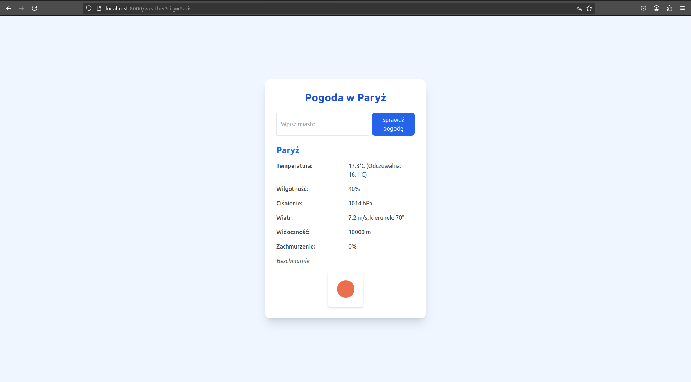

# Weather Flask App

## Description
Weather Flask App is a simple web application for checking the weather in selected cities.  
It uses the OpenWeather API to retrieve current meteorological data.  
The application is containerized using Docker and deployed on a Raspberry Pi using Kubernetes (K3s).  
The project's focus was on deploying the application in a Kubernetes environment and ensuring its proper operation.

Application appearance:  


## Technologies
- Python (Flask)  
- OpenWeather API  
- Docker  
- Kubernetes (K3s)  
- Raspberry Pi  

## Requirements
- Kubernetes (K3s)  
- Docker (optional)  
- OpenWeather API account (to obtain an API key)  

## Installation and Running
### Local Deployment (Docker)
1. Pull the Docker image from Docker Hub:  
   ```sh
   docker pull mateuszkozz/weather-flusk-app
   ```
2. Run the container:  
   ```sh
   docker run -d -p 8000:8000 -e API_KEY_ARG=YOUR_API_KEY mateuszkozz/weather-flusk-app
   ```
3. The application will be available at: `http://localhost:8000`

### Kubernetes Deployment (K3s)
1. Ensure you have K3s installed on the Raspberry Pi.  
2. In the `deploy.yaml` file, insert your API key in the environment variables section or leave the default one.  
3. Apply the Kubernetes configuration:  
   ```sh
   kubectl apply -f deploy.yaml
   ```
4. Check the application status:  
   ```sh
   kubectl get pods
   ```
5. The application uses `Ingress` for handling HTTP traffic, so you need to add the appropriate domain to the `/etc/hosts` file.  
6. The application includes load monitoring and ensures correct operation.  
7. After adding the domain, the application will be available at: `http://weatherapp.com`

## Kubernetes Configuration
The `deploy.yaml` file contains the definitions for Deployment, Service, and Ingress for the application.  
The OpenWeather API key is stored as an environment variable in the `env` section.

Example configuration:
```yaml
to be added later
```

## How to Use the Application?
1. Enter the city name in the text field.  
2. Click the "Check Weather" button.  
3. Weather details such as temperature, humidity, wind speed, and other parameters will be displayed.  

## Future Development
- Ability to select temperature units (°C, °F, K)  
- History of searched cities  
- Adding a weather visualization map  

## Author
Mateusz Kozieł
